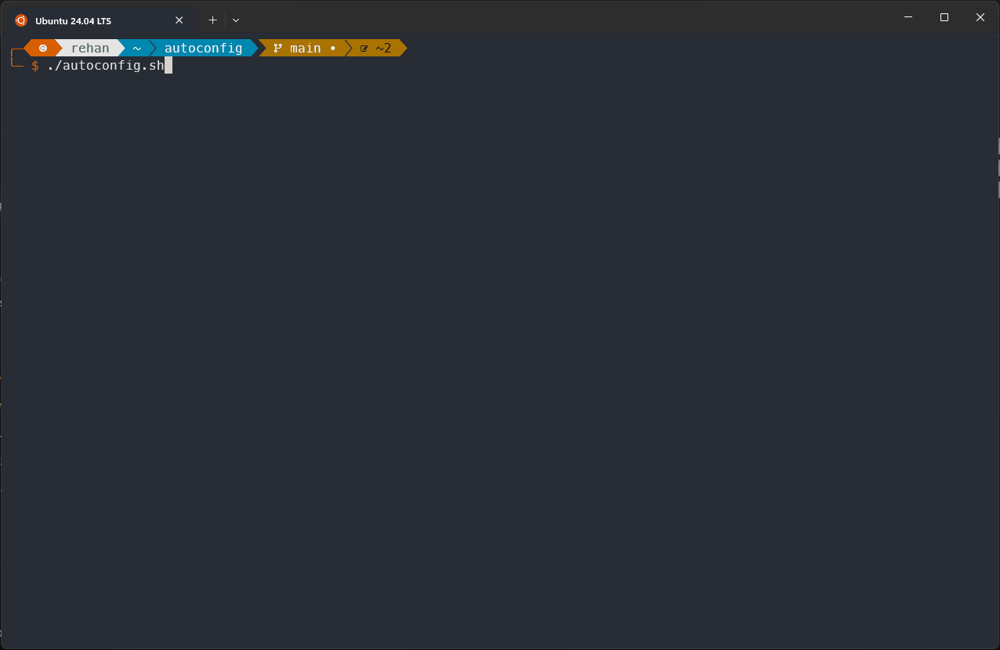
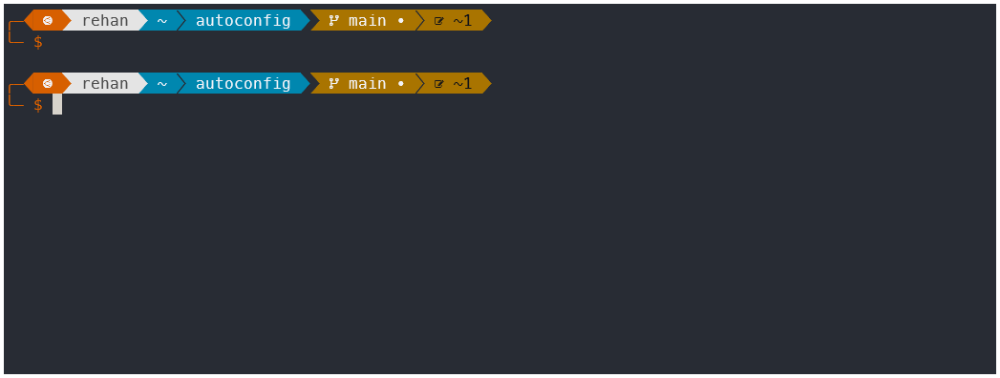
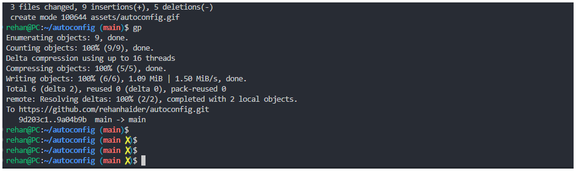
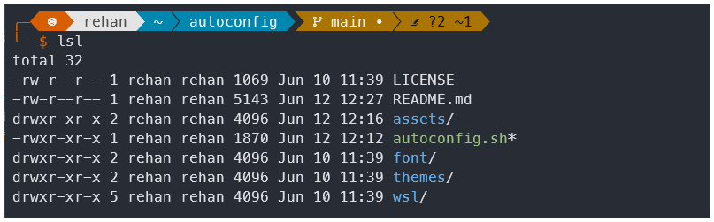
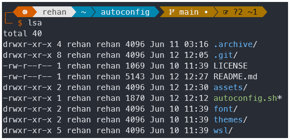
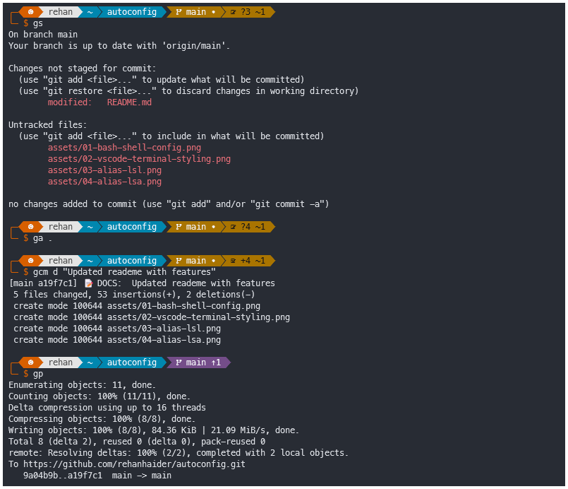

```python
 __          _______ _                      _         _____             __ _
 \ \        / / ____| |          /\        | |       / ____|           / _(_)
  \ \  /\  / / (___ | |         /  \  _   _| |_ ___ | |     ___  _ __ | |_ _  __ _
   \ \/  \/ / \___ \| |        / /\ \| | | | __/ _ \| |    / _ \|  _ \|  _| |/ _  |
    \  /\  /  ____) | |____   / ____ \ |_| | || (_) | |___| (_) | | | | | | | (_| |
     \/  \/  |_____/|______| /_/    \_\__,_|\__\___/ \_____\___/|_| |_|_| |_|\__, |
                                                                              __/ |
                                                                             |___/
```

# Automated Windows & WSL Configuration

Autoconfig is an opinionated configuration of Dev Environment on Windows Subsystem for Linux 2 (WSL2). It if fully automated, customisable if needed, and reversible way of doing on WSL2.

Originally created for my personal use, I decided to share Autoconfig with others who may find it beneficial.



It draws inspiration from [Omakub](https://omakub.org/), a script that configures the Ubuntu OS.

## Features

Autoconfig is an opinionated collection of configuration that I used and find beneficial to my workflow. Some of these include:

### 1. Shell Configuration

Installs and configures [**Oh My Posh**](https://ohmyposh.dev/) and initialises customised version of `quick-term` theme out of the box that is uncluttered and doesn't show useless information such as time, time to execute, weather, etc.



### 2. VSCode terminal styling

Configures the WSL in a way that you're VSCode terminal is slightly modified to show if the current `git` folder is `dirty`. Again clutter free and distraction free that provides only the information you need.



### 3. Navigation Alises

I've never had a problem typing `cd ..` in less than half a second so that's not an alias I build. Instead, the aliases are such that it help understand the information in one glance such as

a. `lsl`: Shows list of all files and directories in the current folder (without hidden .files) with visual cues about which is a directory by appending `/` or an executable by appending `*`. It is an alias for `ls -lF`



b. `lsa`: Shows everything that `lsl` does + hidden files. It is an alias for `ls -AlF`



c. `c` opens up VSCode in current folder. Alias for `code .'`

### 4. Git shortcuts

Handy shortcuts for working with git. Divided in two components

a. `gs`: Shortcut for `git status`
b. `ga`: Shortcut for `git add`

c. `gcm {flag} "<commit message> `: Shortcut for `git commit -m`, but you also need to pass a flag. The flag is the type of commit with choices from the following

1. FEAT (f) => "✨ FEAT: "
2. FIX (b) => "🐛 FIX: "
3. REFACTOR (r) => "♻️ REFACTOR: "
4. DOCS (d) => "📝 DOCS: "
5. STYLE (s) => "💅 STYLE: "
6. PERF (p) => "⚡️ PERF: "
7. TEST (t) => "🔬 TEST: "
8. CHORE (c) => "🔧 CHORE: "

d. `gcam {flag} "<commit message> `: Shortcut for `git commit -am`.
e. `gp`: Shortcut for `git push`

An example is show below of committing this readme changes.



## Supported Platforms

Tested on the following distributions:

1. Ubuntu 22.04 (Windows 11 + WSL2)
2. Ubuntu 24.04 (Windows 11 + WSL2)

It may work on other distributions, but it has not been tested.

## Installing on WSL

To use you can clone this repositorya and run `autoconfig.sh` from the root directory.

```bash
git clone https://github.com/rehanhaider/autoconfig.git
cd autoconfig
./autoconfig.sh
```

By default the script will run in silent mode.

### Interactive Mode

You can run the script in interactive mode by passing the `-i` flag.

```bash
./autoconfig.sh -i
```

You will need to install nerd fonts and configure them in your Microsoft Terminal settings. A font is included in the `font` directory.

## Additional Notes

Please note that Windows configuration is not currently supported, but may be added in future updates.
